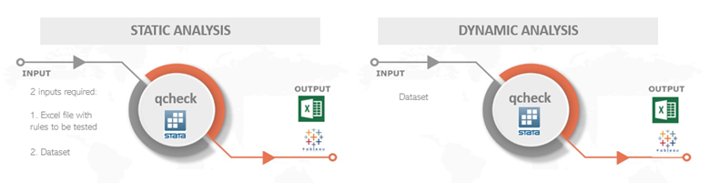
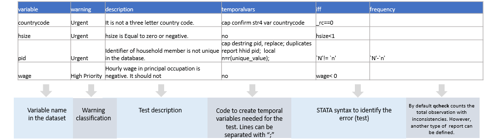

QCHECK: Stata Package for Quality Control of Household Surveys
==============================================================
[](https://github.com/worldbank/qcheck/releases)

Introduction
------------
(short hand for ‘quality check’) is a technical package for quality control of household surveys, comprehending variable-specific analysis in each dataset. In particular, qcheck performs two different but complementary types of assessments: static and dynamic.  

First, the static analysis of qcheck verifies the internal consistent of each variable and its relationship with other variables in the same dataset. That is, it does not only verify that a variable makes sense in itself (e.g, it is not expected to find negative values for age), but also it checks the consistency of one variable with the others (e.g., It is expected that paid workers receive a positive income, rather than zero or missing income). The user is in the ability to create new tests, validations, and crosstabs to automate the assessing of variables across years, countries, regions, among others.

Second, assuming that all the datasets are standardized, the dynamic analysis of qcheck verifies the consistency of the same variable over time. In this regard, the basic case of qcheck dynamic performs four different calculations: 

*	Percentage of missing values.
*	Percentage of zero values.
*	Mean
*	Annualized percentage change of the mean with respect to the previous year.

For the case of a categorical variable, qcheck presents changes in the participation share of each category over time to find inconsistencies. 

Finally, as a final extension of the dynamic analysis, qcheck calculates basic socioeconomic indicators for poverty and inequality. This analysis consists of a set of indicators such as poverty rates, Gini coefficients that allow the user to rapidly identify the main reasons of discrepancies between versions.

## Package components

The qcheck package is composed of several Stata, Excel, and Tableau files that work in companion as a complete system, so that the lack of one of the files forbids the good performance of the entire system. From a predefined, formatted Excel file, the Stata command qcheck retrieves all the information needed to perform the assessment. By default, qcheck provides one Excel file with basic set of tests to check the quality of the GMD database. However, the user has the option to modify such file either by editing the tests or adding tests to it. In addition, the user may create a different excel file to assess a different standardized collection. 

Once the Stata command qcheck has performed the assessment, results are exported into a long-formatted Excel files that is read by a customized Tableau workbook. Users may use the Excel output file for their own purposes or publish the Dashboards as already defined in the qcheck Tableau workbook. 



## Setup and Installation
The qcheck package is composed of three ado-files, three help files, one Tableau file, and one Excel file. The convention of the name of the Excel file is “qcheck_NNN.xlsx” where NNN refers to a set of checks to be applied to a particular collection. 

**A word of caution here**: it is expected that the suffix NNN of the “qcheck_NNN.xlsx” file be the same as the name of the collection to be tested, as it is not usual to have more than one set of test for the same collection; it is better to have one single file with all the tests, instead of two different files with complementary tests. Thus, it is good practice on the qcheck system to assign the name of the collection to the suffix of the Excel file. For instance, the file “qcheck_gmd.xlsx” should contain all the checks to the GMD collection. However, it is possible to assign a suffix different from the name of the collection to the name of the Excel file. For example, the use may have the file “qcheck_ABC.xlsx” to contain the check of the collection SEDLAC. 

By default, qcheck is setup to check the GMD collection, but it could be used to check any standardized/harmonized database. The user has to replace the information in the “qcheck_gmd.xlsx” file with the checks that would be applied to a different collection and then save it with a different name (see step 2). 

For qcheck setup the user must follow the next steps:

### 1. File locations
Save in `C:\ado\plus\q` the following files:
 
*	qcheck.ado
*	qcheck_static.ado
*	qcheck_dynamic.ado
*	qcheck.sthlp

It is recommended to place the `qcheck_NNN.xlsx` file into the same directory `c:\ado\plus\q`. However, the user may choose to place the Excel file in another directory and make sure to use the option `path()` when running the qcheck.ado. 

### 2. Modify Excel file as needed (Spreadsheet "test")
Unless you want to use qcheck as it comes, you may need to modify the file “qcheck_NNN.xlsx”. First, in the spreadsheet “TEST” you can add, modify, or edit the set of quality checks of your database. Each row corresponds to a different check and each column corresponds to a particular feature of the check. 

The first column contains the name of the variable to be checked. It may be the case that one variable has to be checked in relation to another variable, so that both variables are being checked jointly. It does not matter which variable name goes in the name as long as only one name is specified and not both. 

The second column, “Warning,” allows the user to specify the level of urgency. The purpose of this column is merely cosmetic. It allows the user to organize or filter the results easier either in the Tableau dashboard or in their own analyses.  

The third and fourth columns are the checking code, but each column has a particular function. The fourth column (iff) contains the checks properly speaking. That is, this column contains the logical statement that checks the consistency of the variable. For instance, if you wanted to test that the variable that corresponds to the age of the person does not have negative values, positive values above 100, or missing values, you may type something like this: age < 0 | age > 100. As you see, the logical test flags those observations that meet the criterion as inconsistent.

The third column (temporalvars), is for code lines that need to be executed before the logical statement in column “iff.” Sometimes, it is needed to create a temporal variable with certain characteristics in order to check some inconsistencies. For instance, in the GMD collection you may need to test that the combination of household id and person id is unique along the dataset. In order to do so, you can do the following:

``` stata
cap destring pid, replace
duplicates report hid pid
local n = r(unique_value)
count
count if r(N) != `n' // logical statement
```
The first four lines of the code above create a temporal macro that counts the number of observation in the dataset have a unique value for the combination hid and pid. If the dataset was constructed correctly, the number in local n should be the same as the number of observations in the dataset. Therefore, the last line of code is the logical test that verifies the aforementioned statement.  Several things should be kept in mind. 

*	Given that there is only one cell for each check in column “temporalvars”, each line of code must be put apart from the subsequent line with a semicolon (;) instead of break of line.
*	In the example above, the logical statement that goes in the corresponding cell of column “iif” is r(N) != `n', rather than count if r(N) != `n'. Given that by design all the consistency checks count the number of observations with problems, it is inefficient to ask the user to type “count if” for each cell. Instead, it is only necessary to type the logical statement of the code line. 

See the summary table below:


### 3. Modify Excel file as needed (Spreadsheet "Variables")
The dynamic assessment of qcheck performs different analyses depending on the type of variable: welfare, categorical, and basic. Variables classified as ‘welfare’ are assumed to be continuous and estimations of poverty and inequality are only performed with these variables. Categorical variables are numeric in nature but their values refer to a classification or characteristic of the observation rather than to an ordinal correlation between its members. For instance, variable ‘lstatus’ in the GMD collection is the Labor Force Participation. It contains three numeric values: 1, 2, and 3. However, 1 means ‘employed’, 2 means ‘unemployed’, and 3 means ‘out of labor force.’ Finally, the basic classification of variables refers to variables that are either non-categorical or welfare aggregate. 

By default, the first two columns, “raw_varname” and “test_varname”, contain the same information; say the name of the variables. The distinction between the two, however, relies on whether the user wants to apply the checks of one collection to a different collection with different variables names but similar concepts. Thus, the user does not have to re-type all the tests over again when assessing two different collections. For instance, assume you need want to apply to checks of the GMD collection to the SEDLAC collection. Concepts like household id, sampling weights, welfare aggregate, among others, are denoted in both datasets with different variable names. The user only needs to type on the “raw_varname” column the name of the SEDLAC variables in front of the corresponding GMD variable name in the “test_varname” column. In this way, qcheck will ‘rename’ all SEDLAC variable with their equivalent in GMD and apply the checks already denoted in GMD terms. 

See the example below to understand how to fill correctly the Excel.


### 4. Load check into Qcheck
Before using qcheck in Stata you need to ‘load’ the checks into the system. To do so, you have to specify the function ‘create’ in the qcheck command in Stata. Depending on where you saved the Excel file “qcheck_NNN.xlsx”, you need to specify the directory path as indicated in the image below. You need to do this procedure for each “qcheck_NNN.xlsx” input file you have. 


